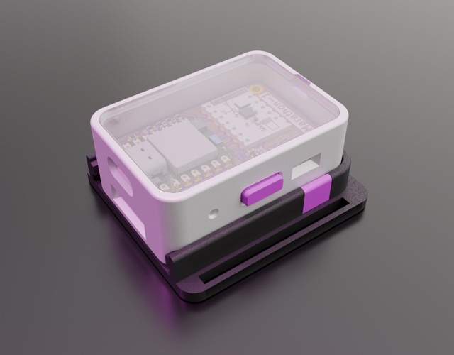

# Jorden-SlimeVR
This repository contains all my open-source tracker designs, and their corresponding firmware. All of which are licensed under CERN-OHL-S to encourage other free open-source designs.
All designs are made within FOSS programs as to be edited by anyone.

##Software
- FreeCAD
- KiCAD
- Blender

# Trackers

## Marathon-1

